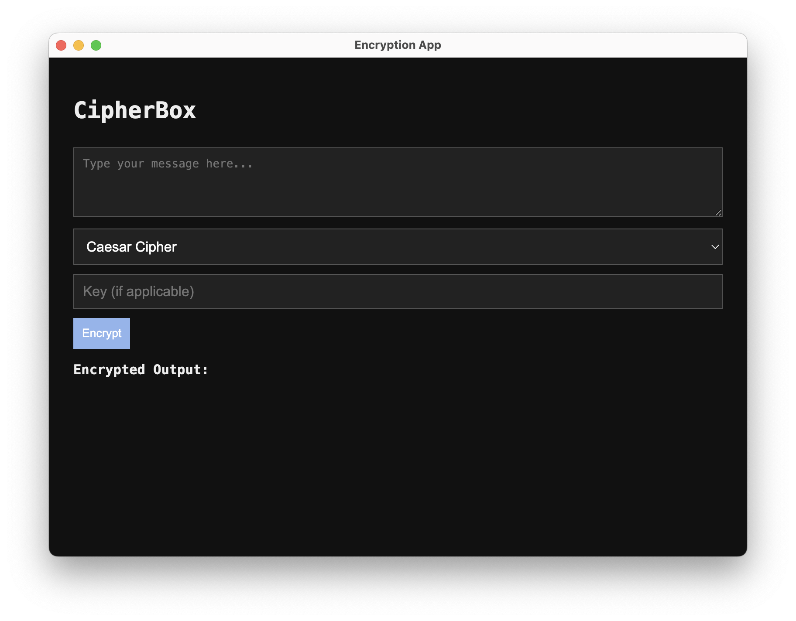

# 🔐 CipherBox

CipherBox is a simple desktop encryption and decryption app built with **Electron**, **HTML**, **CSS**, and **JavaScript**. It allows users to encode or decode messages using classic ciphers with a clean interface.



---

## ✨ Features

- ✅ Caesar Cipher (with shift)
- ✅ Atbash Cipher
- ✅ Vigenère Cipher (with keyword)
- ✅ Base64 encoding/decoding
- ✅ Dynamic encryption/decryption switch
- ✅ Clean dark-themed interface
- ✅ Built as a cross-platform desktop app

---

## 🛠️ Installation

### Requirements

- [Node.js](https://nodejs.org/) (v18+ recommended)

### Setup

```bash
git clone https://github.com/your-username/cipherbox.git
cd cipherbox
npm install
npm start
```

---

## 🗂️ Project Structure

```
.
├── index.html         # User interface
├── style.css          # App styling
├── renderer.js        # Frontend JS logic
├── main.js            # Electron entry point
├── package.json       # Node dependencies
├── screenshot.png     # UI preview (optional)
└── README.md          # You're here
```

---

## 📸 Preview

> Replace `screenshot.png` with your actual app screenshot:


---

## 📄 License

This project is licensed under the [MIT License](https://opensource.org/licenses/MIT) – feel free to use and modify it!

---

## 💡 Future Ideas

- Add clipboard support
- Save encrypted/decrypted output to file
- Add AES or RSA encryption for secure use cases
- Switch between light/dark modes

---

Built with ❤️ using Electron and plain JavaScript.
