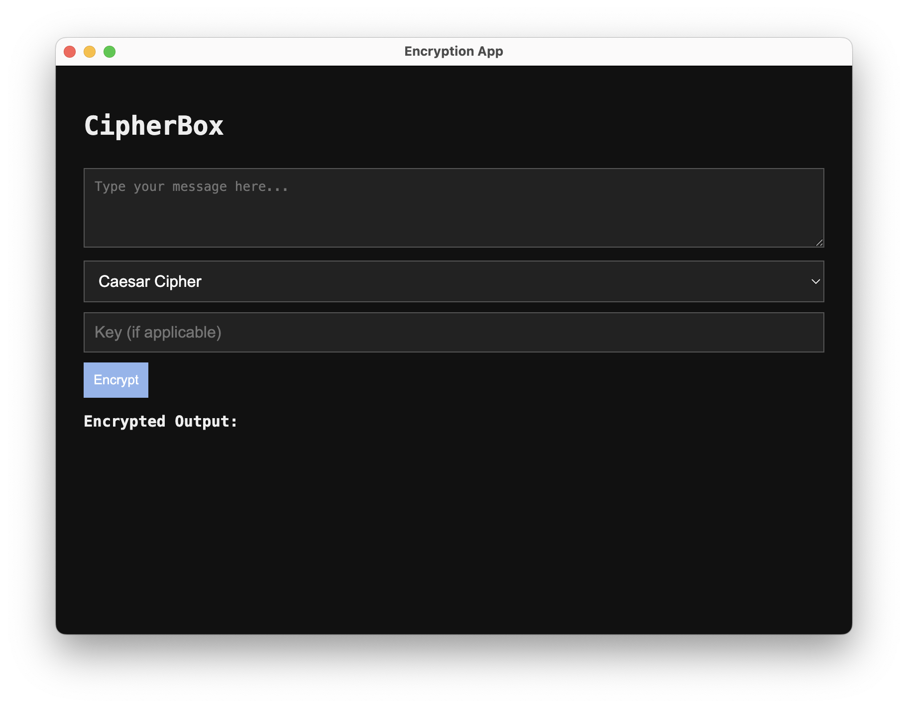

# CipherBox: A Simple Encrytion Menu Desktop App

CipherBox is a simple desktop encryption app built with **Electron**, **HTML**, **CSS**, and **JavaScript**. It allows users to encode messages using classic ciphers with a clean interface.



---

## Features

- Caesar Cipher (with shift)
- Atbash Cipher
- Vigenère Cipher (with keyword)
- Base64 encoding/decoding
- Clean dark-themed interface

---

## 🛠Installation

### Requirements

- [Node.js](https://nodejs.org/) (v18+ recommended)

### Setup

```bash
git clone https://github.com/robinkshah/Encryption-Menu.git
cd encryption-menu
npm install
npm start
```

---

Built with ❤️ using Electron and plain JavaScript. Enjoy!!
